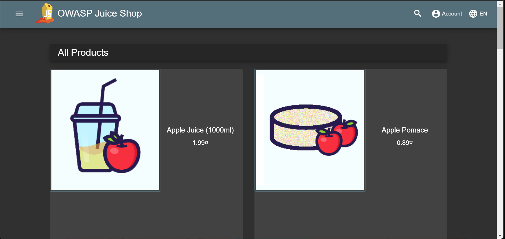
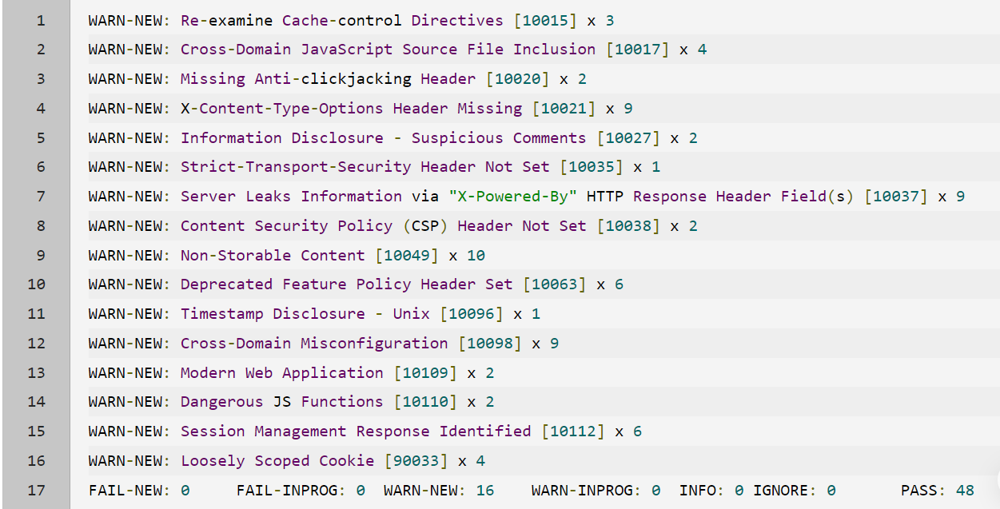

# Dynamic Application Security Testing (DAST): Performing Dynamic Analysis using ___OWASP ZAP___ tool

## Description
    * One of the primary goal for the developer is to __build an Highly Secure application__ to meet the goal the development team often need to review and test their code comprehensively
    * Dynamic Code Analysis is one of the solution for building the secure application
    * In this project we will be looking on to how to install, configure and perform dynamic analysis to develop highly secure application using __OWASP ZAP__ tool

## Objective

* Install and configure OWASP ZAP tool
* Perform Dynamic analysis using the toop
* atlast, Interpret security reports from zap

NOTE: Dynamic Analysis are performed for a Real World OWASP Juice shop App, which is an application developed for security training purpose.

INFO: For a detailed introduction, full list of features, and architecture overview, please visit the official project page: https://owasp-juice.shop.

## pre-requisite
* Install Docker in your Local Workspace
for ubuntu machines
```bash
  sudo apt install docker.io
```
## Steps

### Fetch the Insecure OWASP Juice shop app container Image
* Inorder to perform dynamic scan for the Juice shop application first fetch and run the application. for that execute the below command
```bash
   docker pull bkimminich/juice-shop
   docker run --rm -p 3000:3000 bkimminich/juice-shop
```
* once Started container started running and server listens on port 3000. you may access the application using either http://localhost:3000 or <public-ip>:3000 . and then you will view the application 



* Download and run the OWASP ZAP docker container

```bash
  docker pull softwaresecurityproject/zap-stable
```

* Run the passive scan by passing the jucie shop url as an target url parameter to the Container
```bash
   docker run -t softwaresecurityproject/zap-stable zap-baseline.py -t {TARGET_URL}
``` 
NOTE: zap-baseline.py 

INFO: ZAP will now start its crawling activity of the site and builds a sitemap, and the related output can be reviewed in the terminal. This will take a few minutes to execute.

## output

### Interpret the Dynamic Scan ZAP Report



NOTE: As a developer, our taks is to look up the vulnerability and look at each URL listed as being vulnerable, and then fix the code in vulnerabilites each one by one.

NOTE: If you run a Dynamic Security Testing (DAST) tool early in your development lifecycle, your list probably won't get as big as this example. Had DAST been done earlier in development, there may not have been nine violations of X-Content-Type-Options Header Missing or Cross-Domain Misconfiguration.