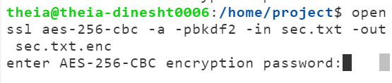
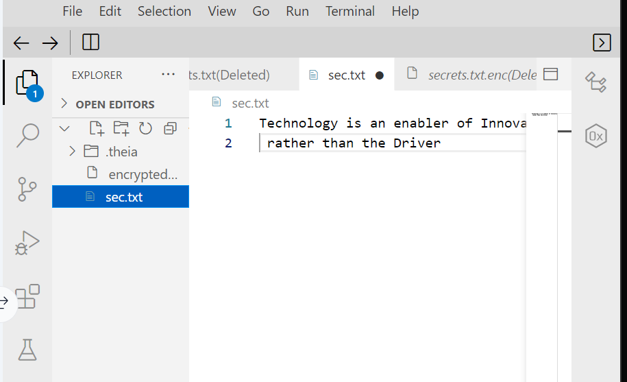
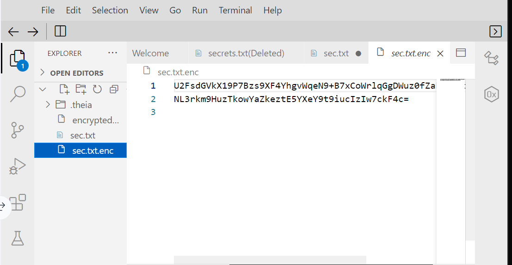
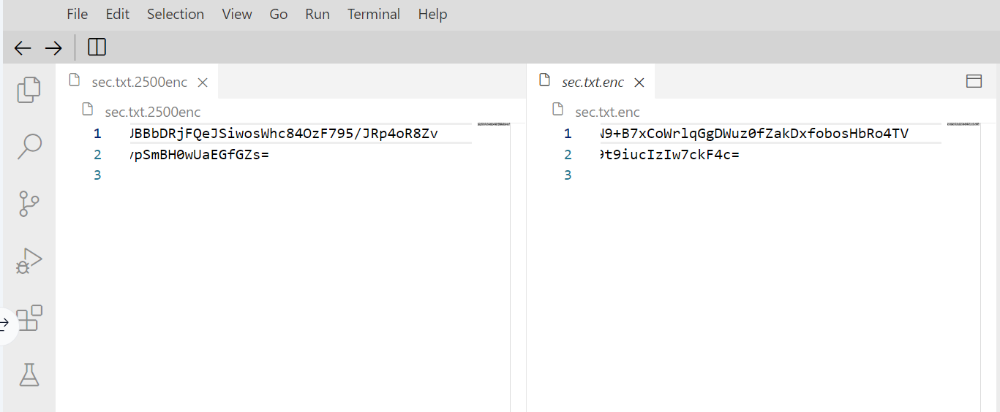

# Open SSL (Secure Scoket Layer) Encryption and Decryption

## Description
      Encrypt files into an unreadable, incomprehensible format using special hasing techniques and also decrypt an encrypted files.

## Objective
    - Perform download and then decrypt an encrypted file
    - Create special and secret keys to encrypt your file
    - Perform decryption of the encrypted files
    - Apply encryption with 2500 iteration that strengthens the encryption standard 

## pre-requisite
* SSL
* TLS
* Data Integrity
* cipher
* aes-256-cbc 
* base64 encode/decode

## Environment setup
  A machine running on any Linux Flavours or other comaptible os and Openssl commandLineTool and Software Library should be installed 

   * Ubuntu/Debian: sudo apt update && sudo apt install openssl
   * CentOS/RHEL: sudo yum install openssl
   * macOS (if not installed via Homebrew): brew install openssl

## Steps
### Decrypting the encrypted file
* wget the encoded and encrypted secret file
```bash
   wget https://cf-courses-data.s3.us.cloud-object-storage.appdomain.cloud/IBM-CD0267EN-SkillsNetwork/labs/module1/encrypted_secretfile
```

(NOTE: You will see that the content is not readable, and is all encrypted. This has been encoded using aes-256-cbc cipher. Each cipher has its own algorithm. aes-256-cbc is one of the older and simpler ciphers, and there are now much better algorithms to encrypt the data.)

* Execute the command to decrypt the file 
```bash
   openssl aes-256-cbc -d -a -pbkdf2 -in encrypted_secretfile -out secrets.txt
```
(INFO:  
    - aes-256-cbc : The cipher algorithm
    - -d : Decrypt
    - -a : base64 decode
    - -pdkdf2 : use password based key derivation function
    - -in : input file location
    - -out : location or file name to save the decoded file )
* Once the above command is executed It will prompt you for a password. this is because when the file was encrypted, it was done so with the aes-256-cbc cipher using a password. type the password in the prompt to decrypt the file. in this case file has been encrypted with aes-256-cbc cipher password __adios__. so, provide it to decrypt the file.

* View the decrypted file

### Encrypt the file
* execute the below command to decrypt the file
```bash
  openssl aes-256-cbc -a -pbkdf2 -in <file-to-be-encrypted-location> -out <file-name>  
```

(NOTE: you will be prompted with creating the password. type the password of your choice. so, that when decrypting the file you have to provide the now created password. then only file will be decrypted )


* view the encrypted file and note that it becomes unreadable and meaningless 

* To encrypt a file in a manner that is not easily decryptable, we can also set the iterations to higher numbers. Higher the iteration increase the time required to brute-force the encrypted file.
```bash
  openssl aes-256-cbc -a -pbkdf2 -iter <iterations-count> -in <file-location-for-the-file-to-be-encrypted> -out <encrypted-file-name>
```
(NOTE: different iteration count have different encrypted content) <br>
(NOTE: *** In OpenSSL, if you don’t specify the iteration count with the -iter option while using -pbkdf2, the default iteration count is 10,000. ***)

* and for decrypting the -iter encrypted files execute
```bash
   openssl aes-256-cbc -a -d -iter <iteration-count> -in <file-location/filename-of-the-encrypt-file> -out <decrypted-output-file-name>
```

* Explore the cipher algorithms available with openssl by typing 
    ```bash
       openssl enc --list
    ```

## Output

### text file befor encryption



### text file after aes-256-cbc cipher encryption 



### comparing the openssl with different iter count



