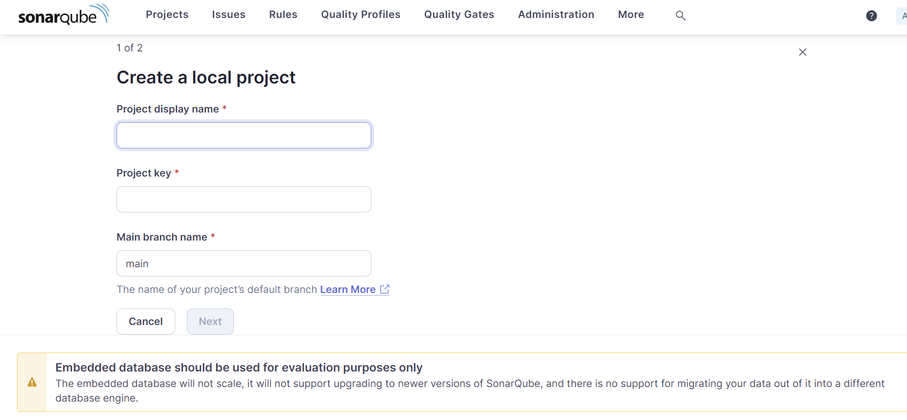

# Static Analysis using Sonar Qube

## Description
     Static Analysis is a debugging method that automatically inspects source code before execution.
     Install, configure the sonarqube for static analysis of the project code.

## Pre-requisite
* Static Application Security Testing (SAST)
* Docker Network


### Sonar Qube Setup example


## Objective
* Install and Configure sonarqube
* Run static analysis scan
* Interpret security reports from sonarqube

## Environment setup
* Install Docker
```bash
   sudo apt install docker.io
   docker version
```


## Steps
* Create network for enabling communication between sonarqube container and postgreSql container. so, that generated scan data are stored and data will be persisted even after deleting the container
```bash
   # for viewing the list of created networks witin the docker engine
   docker network ls
``` 
```bash
   docker network create <network-name>
```
* run the Postgres container in the machine
```bash
   docker run --name <container-name>  -e POSTGRES_USER= root -e POSTGRES_PASSWORD= Test12345 -p 5432:5432 --network mynet -d postgres
```
* create the Sonarqube server container and attach it to the postgres database container
```bash
  
```
NOTE: here in the above command environment variable1 specifies the __jdbc url__ that sonarqube should use to connect to the PostgreSQL Database
2nd & 3rd variable for Providing Authentication to the database 

(here, JDBC means Java Database Connectivity is an API in java that enables java application to connect to and interact with relational database   )

* Ensure Both the container are created successfuly by executing
```bash
   docker ps
```
Now Installtion part of the Sonarqube is completed

* open the Sonarqube UI in you browser by searching for 
```bash
   http://localhost:9000
```
INFO: you will be prompted with sonarqube authentication page intially username and password are admin, admin


* After login Process completed you will be naviagted to home page

 

* create a Project 



* In order to run sonar qube scanner on your code. its mandatory to Generate scanner token for the project.
NOTE: there are several to generate project token in this project we will be generating manually


once token is generated store it in the safer place so that you can use it in the project for analysis

* Ready the Sonarqube scanner

__NOTE: it is important to understand that sonarqube server that stores the results of scan is seperate and distinct from the Sonarqube scanner which performs actual scanning__

  * Firstly pull the sonarqube image locally for use
    ```bash
       docker pull sonarsource/sonar-scanner-cli
    ``` 
  * Create an alias
    ```bash
       alias sonar-scanner='docker run --rm -v "$(pwd):/usr/src" sonarsource/sonar-scanner-cli'
    ```
NOTE: Any arguments that you pass into the sonar-scanner command will be passed into the container version as well. This is how you can easily run commands in Docker containers as if they were actually installed on your computer.

* start the static Analysis by executing the following command which was obtained from the token creation in sonarqube
```bash
  sonar-scanner \
    -Dsonar.projectKey=temp \
    -Dsonar.sources=. \
    -Dsonar.host.url=https://dinesht0006-9000.theiadocker-2-labs-prod-theiak8s-4-tor01.proxy.cognitiveclass.ai \
    -Dsonar.token=sqp_3141551400d64c1429ea3898f04a6041ad792102
```

## Output

once after the scanning is completed Interpret the scan result in the UI


